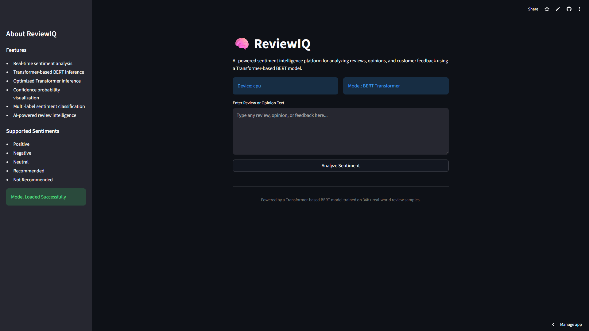
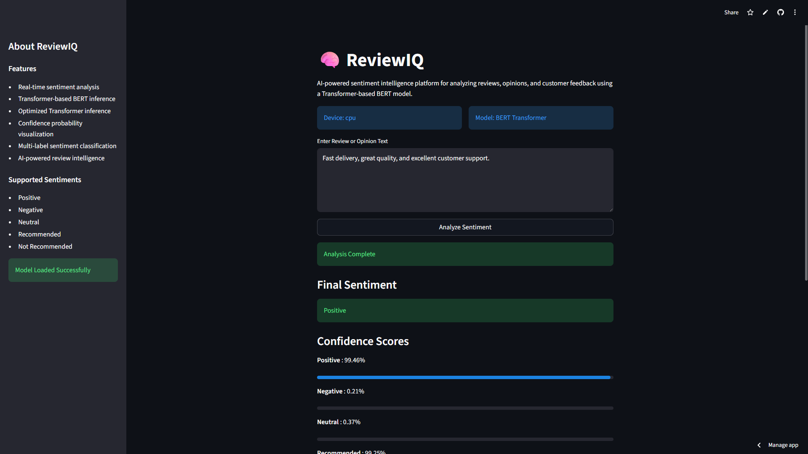
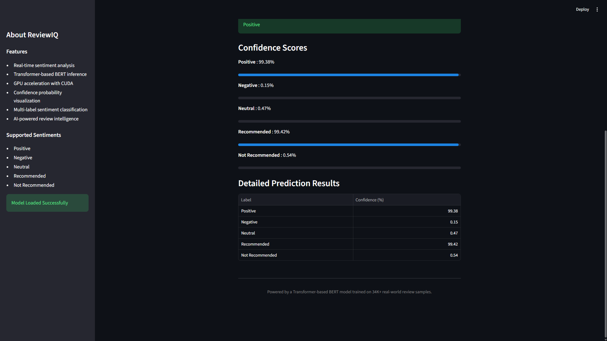
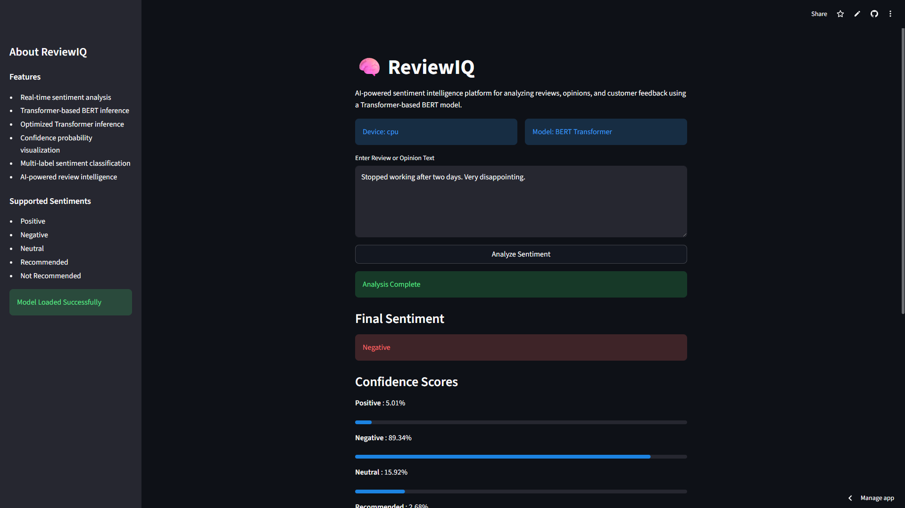
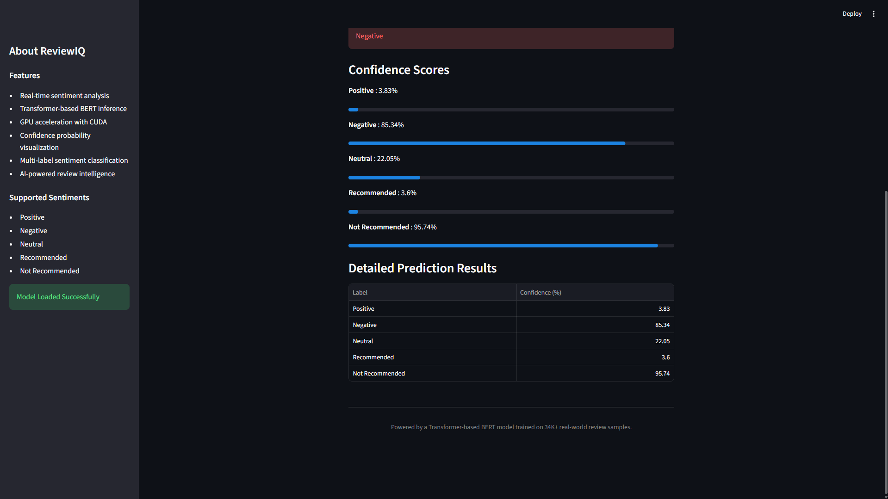

# 🧠 ReviewIQ

AI-powered sentiment intelligence platform built using BERT, PyTorch, CUDA, and Streamlit for real-time multi-label sentiment analysis.

---

# 🚀 Overview

ReviewIQ is a GPU-accelerated NLP application capable of analyzing reviews, opinions, and customer feedback using a Transformer-based BERT model.

The model performs multi-label sentiment classification and predicts:

- Positive
- Negative
- Neutral
- Recommended
- Not Recommended

The application supports real-time inference through an interactive Streamlit web interface with confidence probability visualization.

---

# ✨ Features

- Transformer-based BERT sentiment analysis
- Multi-label sentiment classification
- Real-time review prediction
- Confidence probability visualization
- Interactive Streamlit web application
- Saved model inference pipeline
- Clean and professional UI
- Support for multiple review domains

---

# 🧠 Model Details

- Model Architecture: BERT (bert-base-uncased)
- Framework: PyTorch
- Interface: Streamlit
- Training Device: NVIDIA RTX 4060 Laptop GPU
- Mixed Precision Training Enabled
- Multi-label classification using sigmoid activation
- The trained model weights are excluded from this repository due to size limitations.

The model was trained on 34K+ real-world Amazon product reviews and generalized for broader sentiment analysis tasks.

---

# 📊 Model Performance

## Best Test Set Results

| Metric | Score |
|---|---|
| Test Accuracy | 92.87% |
| Test F1 Micro | 96.00% |
| Test F1 Macro | 72.58% |
| Test Precision Micro | 96.24% |
| Test Recall Micro | 95.76% |

## Training Performance Summary

The model was trained and evaluated across multiple training runs to verify consistency and stability.

Key observations:

- Stable convergence across training sessions
- Strong generalization performance
- Consistent validation accuracy around 92%+
- Effective multi-label sentiment prediction
- High precision and recall performance

---

## 🚀 Live Demo

[ReviewIQ Live App](https://sc-review-iq.streamlit.app/)

---

# 🖥️ Application Screenshots

## Main Interface



---

## Positive Review Prediction




---

## Negative Review Prediction





---

# 🛠️ Tech Stack

- Python
- PyTorch
- Hugging Face Transformers
- Streamlit
- CUDA
- NVIDIA GPU Acceleration
- Pandas
- Scikit-learn

---

# 📂 Project Structure

```text
ReviewIQ/
│
├── train.py
├── predict.py
├── app.py
├── requirements.txt
├── README.md
├── .gitignore
└── data.csv
```

---

# ⚙️ Installation

## Clone Repository

```bash
git clone <YOUR_REPOSITORY_URL>
cd ReviewIQ
```

## Create Virtual Environment

```bash
python -m venv venv
```

## Activate Virtual Environment

### Windows

```bash
venv\Scripts\activate
```

### Linux / MacOS

```bash
source venv/bin/activate
```

## Install Dependencies

```bash
pip install -r requirements.txt
```

---

# 🚀 Run The Application

## Launch Streamlit App

```bash
streamlit run app.py
```

---

# 🧪 Train The Model

```bash
python train.py
```

---

# 💾 Model Weights

The trained BERT model weights are not included in this repository due to file size limitations.

You can train the model locally using:

```bash
python train.py
```

# 📦 Dataset

Dataset not included due to GitHub file size limitations.

---

# 📌 Future Improvements

- CSV batch review prediction
- Advanced analytics dashboard
- Exportable prediction reports
- Deployment support
- Custom frontend integration
- Aspect-based sentiment analysis

---

# 👨‍💻 Author

Developed as an advanced NLP and AI engineering project focused on Transformer-based sentiment intelligence and real-time inference systems.
